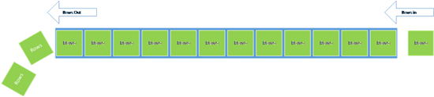

# 实时数据的自动保留策略
---

Power BI 服务中的自动保留策略是一个查询字符串参数，用于启用默认保留策略，以便在新数据不断进入仪表板时自动清除旧数据。
第一个保留策略称为基本先进先出 (FIFO)。
如果已启用，数据将收集在表中，直到它达到 200,000 个行。
一旦数据超出 200,000 个行，最早的行将从该数据集中删除。
这将保持在 200,000 和 210,000 个行之间，仅包含最新数据。

首次创建数据集时将启用保留策略。
你只需将“defaultRetentionPolicy”查询参数添加到 POST 数据集调用并令其值等于“basicFIFO”即可。

    POST https://api.powerbi.com/v1.0/myorg/datasets?defaultRetentionPolicy={None | basicFIFO}

##了解有关如何启用默认保留策略的详细信息

-   [创建数据集](Create-Dataset.md)
-   [使用我们的交互式 API 控制台立即尝试调用](http://docs.powerbi.apiary.io/#reference/datasets/datasets-collection/create-a-dataset)

