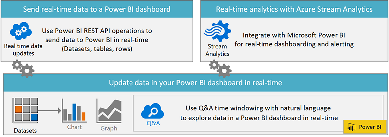

# 创建实时 Power BI 仪表板
---

你可以使用 Microsoft Power BI REST API 或 Microsoft 流分析创建一个实时 Power BI 仪表板。
快速向现有解决方案添加分析进行实时数据监视。

###使用 Power BI REST API 将数据发送到实时 Power BI 仪表板

借助 Power BI REST API，你可以创建自己的业务解决方案，以将数据实时推送到 Power BI 仪表板中。
当数据变更时，你的仪表板将进行实时更新。
你可以使用你所选的技术（包括 .NET、JQuery 或 Ruby）编写自己的应用。
Power BI REST API 使用诸如 OAuth2 的行业标准，并且具有 REST 操作，可将数据实时推送到 Power BI 仪表板中。

[开始创建 Power BI 应用](Get-started-creating-a-Power-BI-app.md)

-   创建数据集，并添加和删除行
-   将数据从任意应用实时推送到 Power BI 中
-   设置保留策略来自动清除旧数据
-   发现现有数据集上的元数据

###使用 Azure 流分析将仪表板信息和警报实时推送到 Power BI 中

Microsoft Azure 流分析是完全托管的实时流计算服务，可通过企业级 SLA 在云中进行低延迟、可缩放的流数据处理。
通过与 Microsoft Azure 事件中心和 Microsoft Power BI 集成，实时推送仪表板信息和警报以及强大的可视化功能均可通过数据管道实现。

了解有关 [Azure 流分析](http://azure.microsoft.com/services/stream-analytics)的详细信息。

-   每秒接收数以百万计的事件（高达 1 GB/s）
-   较低的处理延迟、自动适应（次秒级到几秒）
-   在不同流之间关联，或与引用数据关联
-   实时查找数据中的模式或缺少的模式

###使用自然语言查询 (Q&A) 在数据中查找相应答案

借助“常见问题”，你可以将时域窗口与自然语言结合使用，从而在 Power BI 中实时探索数据。使用“常见问题”在 UTC 时间列中显示动态时间范围，例如：
-   过去 10 分钟内 josh 的心率
-   过去 90 分钟内的总访问次数（按时间）
-   过去 90 分钟内的总访问次数（按为 UTC 时间的本地时间）

了解有关 [Power BI 常见问题](https://support.powerbi.com/knowledgebase/articles/474690)的详细信息。

