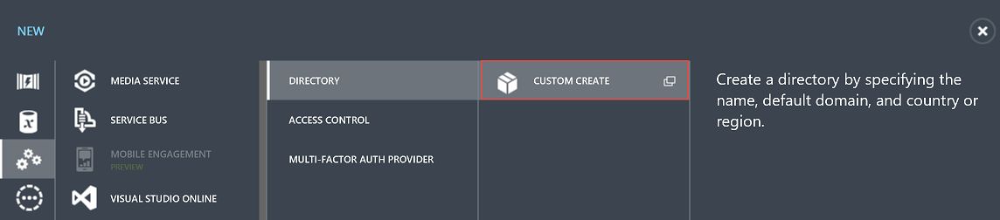
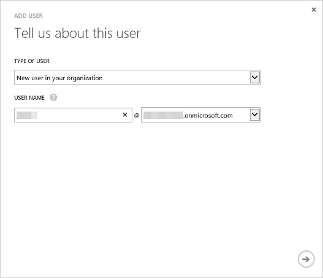
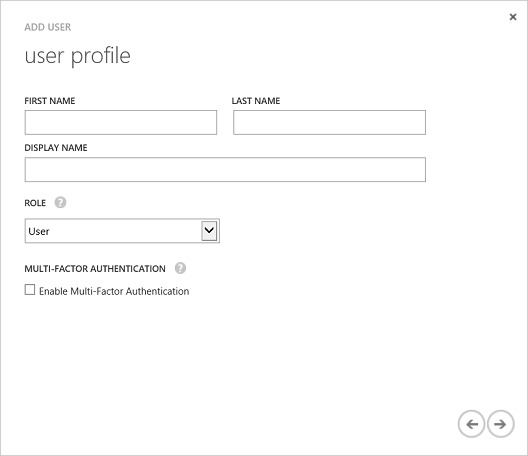

# 创建 Azure Active Directory 租户
---

使用 Power BI REST API，你可以在任何支持调用 REST 操作的平台中创建 Power BI 应用。
但是，在开始创建 Power BI 应用之前，你需要一个 **Azure Active Directory** 和组织用户，以及一个 [Power BI 服务帐户](Sign-up-for-Power-BI-service.md)。

###本文内容

- [创建 Azure Active Directory 租户](#setup)
- [向你的 Azure Active Directory 租户添加用户](#newuser)

##为 Power BI 应用创建 Azure Active Directory 租户

Power BI 应用与 **Azure Active Directory** (Azure AD) 集成，从而为你的应用提供安全的登录和授权。
若要将 Power BI 应用与 Azure AD 集成，请使用 Azure 管理门户向 Azure AD 注册有关应用程序的详细信息。

**重要说明** 若要注册 **Power BI 服务**，你的 **Azure Active Directory** 中必须至少有一个组织用户。
使用组织用户[注册 Power BI 服务](Sign-up-for-Power-BI-service.md)。

###创建 Azure Active Directory 租户

在开始创建 Power BI 应用之前，你需要 **Azure Active Directory** 和一个组织用户。
下面是 **Azure Active Directory** 的具体设置方法：

1. 导航到 https://manage.windowsazure.com 并使用具有 Azure 订阅的帐户登录。
2. 单击左侧窗格中的“ACTIVE DIRECTORY”****管理图标。

    

3. 单击页面底部的“新建”****按钮。
4. 依次选择“应用服务”****>“ACTIVE DIRECTORY”****>“目录”****>“自定义创建”****

    

5. 在“添加目录”****页上，输入名称和域名。
    对于国家或地区，请选择美国或可使用 Power BI 的国家/地区。
    
    

6. 选择“确定”图标。
    Azure Active Directory 已创建。

###向你的 Azure Active Directory 租户添加用户

使用 Azure AD 中的用户注册 **Power BI 服务**。
首次登录到 **Power BI 服务**后，你会看到已添加到 Azure AD 的 **Power BI 服务**，该服务允许你使用适当的权限创建 Power BI 应用。
下面介绍了如何将用户添加到 Azure Active Directory：

1. 导航到 https://manage.windowsazure.com 并使用具有 Azure 订阅的帐户登录。
2. 单击左侧窗格中的“ACTIVE DIRECTORY”****管理图标。
3. 单击页面底部的“新建”****按钮。
4. 依次选择“应用服务”****>“ACTIVE DIRECTORY”****>“目录”****>“自定义创建”****。

    

5. 在“添加目录”****页上，输入名称和域名。
    对于国家或地区，请选择美国或可使用数据目录的国家/地区。
    
    

6. 选择“确定”图标。
    Azure Active Directory 已创建。

###向你的 Azure Active Directory 租户添加用户

你需要使用 Azure AD 中的用户注册 Azure AD 应用。
下面介绍了如何将用户添加到 **Azure Active Directory** 租户：

1. 在“Azure Active Directory”****中，单击“用户”****。

    

2. 在页面底部，单击“添加用户”****。
    用户帐户用于注册 Power BI 应用。
    
3. 在“向我们告知此用户页面”****中：

    1. 对于“用户类型”****，请选择“组织中的新用户”****。
    2. 输入你的**用户名**。
    3. 单击“下一步”****。

        

4. 在“用户配置文件”****页上，输入你的“显示名称”****。
    显示名称是必填字段。

    

5. 单击“下一步”****。
    对于“角色”****，你可以使用“用户”****。

6. 单击“创建”****来创建一个临时密码。
    新用户将分配到一个临时密码，该密码必须在第一次登录时进行更改。
7. 在“获取临时密码”****页中，复制临时密码，然后单击“完成”****图标。
    在首次登录 AAD 时将使用临时密码。
8. 单击“完成”****图标后，将创建一个新的 Azure AD 用户。

具有 **Azure Active Directory** 租户和组织用户后，你需要注册 Power BI。

##下一步创建 Power BI 应用 - 注册 Power BI

- [注册 Power BI](Sign-up-for-Power-BI-service.md)

**注意** 在注册 Power BI 服务时，应使用组织用户。
首次登录到 **Power BI 服务**后，你将看到已添加到 Azure AD 中的 **Power BI 服务**。

##另请参阅

- [什么是 Azure AD Directory？](https://msdn.microsoft.com/en-us/library/azure/jj573650.aspx)
- [如何获取 Azure Active Directory 租户](https://azure.microsoft.com/en-us/documentation/articles/active-directory-howto-tenant/)

