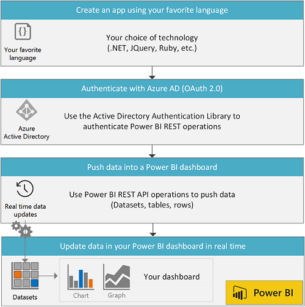

# Power BI REST API 概述
---

[开始创建 Power BI 应用](Get-started-creating-a-Power-BI-app.md)

Power BI 显示仪表板为交互式，并且可以通过许多不同数据源实时创建和更新。
就像汽车中的仪表板显示有关汽车的重要信息（例如汽车速度、燃油油位或引擎的运行状况）一样，Power BI 中的仪表板将显示有关业务的重要信息。

###通过实时数据推送创建自定义的 Power BI 仪表板

使用支持 REST 调用的任何编程语言，你可以创建实时更新 Power BI 仪表板的业务解决方案。

借助 Power BI REST API，你可以：

*   [使用 Azure Active Directory OAuth2 对 Power BI REST 操作进行身份验证](Authenticate-to-Power-BI-service.md)
*   [创建并获取数据集](Dataset-operations.md)
*   [设置保留策略来自动清除旧数据](Automatic-retention-policy-for-real-time-data.md)
*   [获取和更新表架构](Table-operations.md)
*   [添加和删除行](Row-operations.md)
*   [获取组](Get-Groups.md)

下面是使用 REST API 创建的 Power BI 应用的总体流程。

###可以通过以下一些方式使用 Power BI REST API

*   **从你的应用创建实时仪表板** -
    从设备、传感器和应用程序实时进行深入了解。
    使用 **Power BI REST API** 或 [Azure 流分析](http://azure.microsoft.com/services/stream-analytics/)将数据直接从你的应用程序推送到 Power BI 中的数据集。
*   **查看 GitHub 上的 Power BI 项目和我们的示例** - GitHub 上有许多 Power BI 项目：请转到 [GitHub](https://github.com/search?utf8=%E2%9C%93&q=Power+BI) 并搜索“Power BI”。或者查看[我们的示例](http://go.microsoft.com/fwlink/?LinkId=618971)。我们提供以下示例：
    
    *   [客户端应用示例](Power-BI-client-app-sample.md)：一个控制台应用，用于演示如何对客户端应用进行身份验证以及调用所有 Power BI 操作。
    *   [Web 应用示例](Power-BI-web-app-sample.md)：一个 Web 应用，用于演示如何对 Power BI Web 应用进行身份验证。
*   [**试用 Power BI REST API**](http://docs.powerbi.apiary.io/) -
    在 Apiary 交互式 API 控制台中，你可以尝试使用所有 Power BI REST API 操作，例如[创建数据集](Create-Dataset.md)和[获取数据集](Get-Datasets.md)。

###了解有关 Power BI REST API 的详细信息

*   [开始创建 Power BI 应用](Get-started-creating-a-Power-BI-app.md)
*   [Power BI REST API 参考](Power-BI-REST-API-reference.md)

