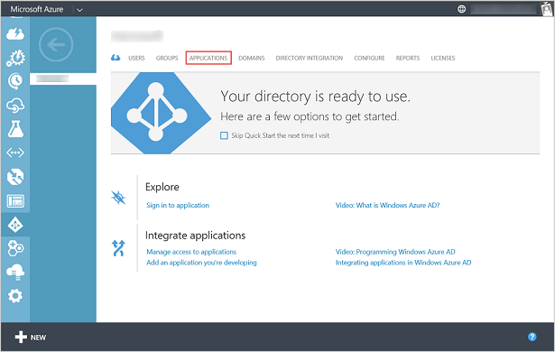
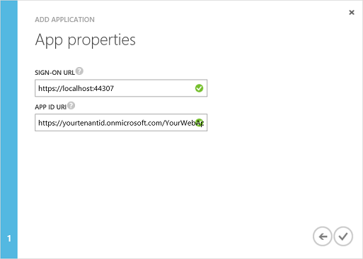
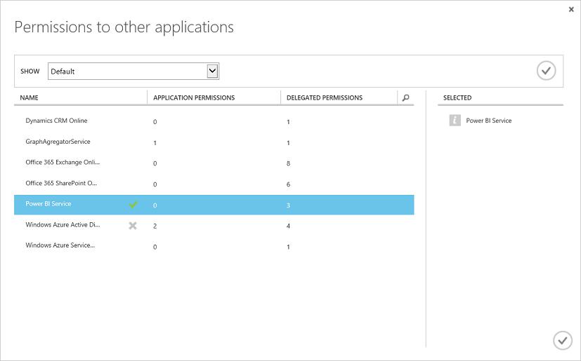
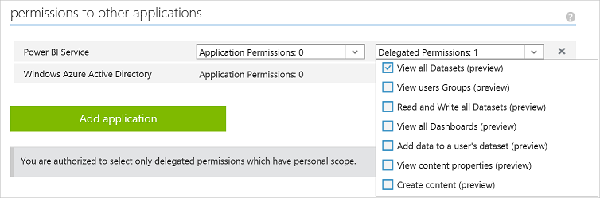

# 注册 Web 应用
---

本文演示了如何在 Azure Active Directory (Azure AD) 中注册 Power BI Web 应用。
若要允许你的应用程序访问 Power BI REST API，你需要将应用程序注册到 **Azure Active Directory**。
这样，你便可以为你的应用程序建立标识，并指定 Power BI REST 资源的权限。
有关 Power BI 权限的列表，请参阅 [Power BI 权限](Power-BI-permissions.md)。

**重要说明**在开始创建 Power BI 应用之前，你需要一个 [Azure Active Directory 和组织用户](Create-an-Azure-Active-Directory-tenant.md)，以及一个 [Power BI 服务帐户](Sign-up-for-Power-BI-service.md)。

可采用两种方式注册你的 Web 应用：使用 Power BI 应用注册工具或在 Azure 管理门户上。
因为只需填充几个字段，所以 Power BI 应用注册工具是最简单的选项。
但是，借助此工具，将需要使用 Azure 管理门户来管理你的应用设置。

###本文内容

- [使用 Azure 管理门户注册 Web 应用](#web)
- [如何获取客户端 ID](#clientID)
- [如何获取客户端密钥](#clientSecret)

##为 Web 应用注册 Azure 管理门户

在注册 Web 应用时，你将收到**客户端 ID** 和客户端**密钥**。
应用程序在向客户请求权限时，使用该**客户端 ID** 来向用户标识自己的身份。
Web 应用使用该客户端**密钥**向 **Power BI 服务**安全标识自身。

若要了解如何使用 Azure AD **客户端 ID** 和客户端**密钥**对 Web 应用进行身份验证，请参阅[对 Web 应用进行身份验证](Authenticate-a-web-app.md)。

下面介绍了如何注册客户端应用：

1. 接受 [Microsoft Power BI API 条款](https://powerbi.microsoft.com/en-us/api-terms)。
2. 登录到你的 Microsoft Azure 订阅，网址为 https://manage.windowsazure.com。
3. 在左侧服务面板中，选择“ACTIVE DIRECTORY”。****
4. 单击任意 Active Directory。

    

5. 单击“应用程序”。****

    

6. 单击“添加”。****
    
    
7.  在“向我们描述你的应用程序”****中，输入“名称”****、选择“Web 应用程序和/或 Web API”****类型，然后单击“下一步”****图标。

    

8. 在“应用属性”****中，输入 **SIGN-ON URL** 和 **APP ID URI**。
    **SIGN-ON URL** 是你的 Web 应用 URL，例如 https://localhost:44307。
    **APP ID URI** 是 Azure 租户 URI，后跟应用名称。
    例如，https://yourtenant.onmicrosoft.com/YourWebApp。

    

9.  单击“完成”图标。****
10. 在应用程序页中，选择“配置”。****
    “配置”****页上有应用的“客户端 ID”****和“密钥”****。

    

11. 对于 Web 应用，你需要一个客户端**密钥**。
    在“密钥”****部分中，选择某一持续时间。
    保存后，将显示该****密钥。
    请确保复制该密钥；否则，在将来导航到配置页时将不再显示该密钥。

12. 在“配置”****页中，单击“添加应用程序”****。
13. 在“针对其他应用程序的权限”中，选择“Power BI 服务”。********

    

    **重要说明：**如果你在“针对其他应用程序的权限”列表中未看到“Power BI 服务”，你需要注册 [Power BI 服务](https://www.powerbi.com/)。********
    若要注册 Power BI 服务，你的 Azure Active Directory (AAD) 租户中至少需要一个组织用户。
    如果你没有 Azure Active Directory (AAD) 租户，请参阅[安装 Azure Active Directory](Setup-Azure-Active-Directory.md) 来创建一个 Azure AD 租户，并在 Azure AD 租户中创建一个组织用户。

14. 单击该页面右下角的“完成”****图标。
15. 在“其他应用程序的权限”****组中，选择所有“委派权限”****。
    有关 Power BI 权限的详细信息，请参阅 [Power BI 权限](Power-BI-Permissions.md)。

    

16. 单击“保存”。****

    ** 重要说明 **
    对于 Web 应用，你需要一个客户端**密钥**。
    该客户端**密钥**将在**保存**后显示。
    请确保复制该密钥；否则，在将来导航到配置页时将不再显示该密钥。

##如何获取客户端应用 ID

当你注册 Web 应用时，你会收到一个**客户端 ID**。
应用程序在向客户请求权限时，使用该**客户端 ID** 来向用户标识自己的身份。

下面介绍了如何获取客户端应用 ID：

1. 登录到你的 Microsoft Azure 订阅，网址为 https://manage.windowsazure.com。
2. 在左侧服务面板中，选择“ACTIVE DIRECTORY”。****
3. 选择任意 Active Directory。
4. 单击“应用程序”。****
5. 选择一个应用程序。
6. 在应用程序页中，选择“配置”。****
7. 在“配置”页中，复制“客户端 ID”。********

    

##如何获取客户端密钥

对于 Web 应用，你需要一个客户端**密钥**。
当你注册 Web 应用时，Azure AD 将生成一个密钥（请参阅上面的步骤 11）。
在“密钥”****部分中，选择某一持续时间。
保存后，将显示该密钥。
请确保复制该密钥；否则，在将来导航到配置页时将不再显示该密钥。

##创建 Power BI 应用的后续步骤

- [创建 Power BI 应用](Introduction-to-creating-a-Power-BI-app.md)
- [了解如何使用 Azure AD 进行身份验证](Authenticate-to-Power-BI-service.md)

